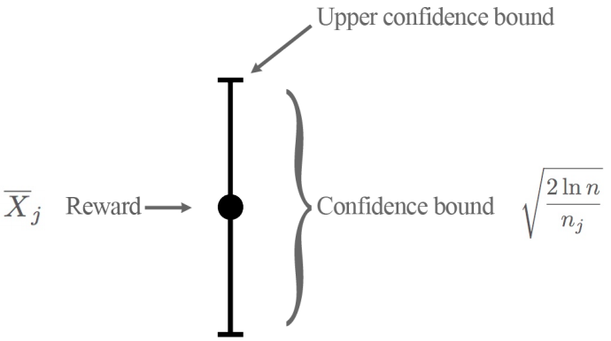

## **Game AI**

Game AI is one of the most promising research areas which involves teaching an AI agent to learn to play a complex game. Recently there have been many exciting works like [AlphaGO](https://deepmind.com/research/case-studies/alphago-the-story-so-far) by DeepMind and [learning to play Hide and Seek by OpenAI](https://www.vox.com/future-perfect/2019/9/20/20872672/ai-learn-play-hide-and-seek). The game environment provides many complex scenarios to test several algorithms which can then be adapted to real-life important applications like autonomous driving and robotics.

In this article find my approach to let an AI agent learn to play Connect 4. Though simple for humans, large action space and several permutations and combinations of different board states prove to be challenging for an AI agent to learn to win. I used a Monte Carlo Tree Search approach to solve this problem and I am happy to share that I landed up in the top 30% among all the participants (my first Kaggle competition).

## **About Connect 4**

*Connect 4* is a turn-based game where two players drop colored discs into a vertical grid alternatively. The aim of each player is to form a **sequence of four discs** in a row before its opponent. This is a **perfect information game**, meaning each player is well informed of all the events that have previously occurred.

Alternatively, Connect 4 can also be considered as a **zero-sum** game meaning there is no mutual win or loss.

## **Kaggle environment to load ConnectX**

* Kaggle provides an amazingly easy to use OpenAI like gym environment for the Connect 4 game.

* In order to final test your agent, you can also use predefined **random** and **negamax** agents.

## **Different Approach to solve the problem**

There can be many different algorithms to solve this problem like

* Minimax
* Minimax with alpha-beta pruning
* Q Learning
* Proximal Policy Algorithm
* Monte Carlo Tree Search
* and many more

I preferred using the Monte Carlo Tree Search algorithm because of its flexibility to solve games with large branching factors. The main bottleneck for games involving large action space (7 in case of connect4) is that requires it requires an extensive search considering the different permutation and combination of the given board. MCTS tries to overcome this problem in an efficient way as explained below by reducing the search space while at the same time maintaining efficiency.

## **Monte Carlo Tree Search: Theory**

**Idea**: Monte Carlo Tree Search builds a search tree with n nodes with each node annotated with the **win count** and the **visit count**. Initially, the tree starts with a single root node and performs iterations as long as resources are not exhausted.

* **Initial Setup** — Start with a single root (parent) node and assign a large random UCB value to each non visited (child) nodes.

MCTS consists of four main steps

* **Selection** — In this phase, the agent starts at the root node, selects the most urgent node, apply the chosen actions, and continue till the terminal state is reached. To select the most urgent node upper confidence bound of the nodes is used. The node with the maximum UCB is used as the next node. The UCB process helps overcome **exploration** and **exploitation** dilemma. Also well known as a Multi-Armed bandit problem where the agent wants to maximize one’s gains while playing (Lifelong Learning).

* **Expansion** — When UCB can no longer be applied to find the next node, the game tree is expanded further to include an unexplored child by appending all possible nodes from the leaf node

* **Simulation** — Once expanded the algorithm selects the child node either randomly or with a policy until it reaches the final stage of the game

* **Backpropagation** — When the agent reaches the final state of the game with a winner, all the traversed nodes are updated. The visit and win score for each node is updated.

The above steps are repeated for some iterations.

* Finally, the child of the root node with the highest number of visits is selected as the next action as more the number of visits higher is the UCB.

## **MCTS Summary**

* Each iteration starts at the root.
* Follows tree policy to reach a leaf node.
* Node N is added.
* Perform a random rollout.
* Value backpropagated up the tree.

## **Other common approaches**
Another common approach Minimax with alpha-beta pruning.

**Idea** — If beta’s (minimizing player) maximum score becomes less than the minimum score of the maximizing player(alpha), the maximizing player is not required to consider other nodes.

Works well only when:

* A good heuristic value function is known
* The branching factor is modest.

## **Implement MCTS to play Connect 4**
Check out my implementation of Monte Carlo Tree Search to play Connect 4 to rank in the top 30% of this [Kaggle Competition](https://www.kaggle.com/c/connectx) in this [Colab Notebook](https://colab.research.google.com/drive/1b6ikDpfggh_QeIKtDoqt-4DtJc0eeLk2?usp=sharing).

